## Environment setup


```r
library(spaero)
library(tidyverse)
```

```
## ── Attaching packages ─────────────────────────────────────── tidyverse 1.3.0 ──
```

```
## ✔ ggplot2 3.2.1     ✔ purrr   0.3.3
## ✔ tibble  2.1.3     ✔ dplyr   0.8.3
## ✔ tidyr   1.0.0     ✔ stringr 1.4.0
## ✔ readr   1.3.1     ✔ forcats 0.4.0
```

```
## ── Conflicts ────────────────────────────────────────── tidyverse_conflicts() ──
## ✖ dplyr::filter() masks stats::filter()
## ✖ dplyr::lag()    masks stats::lag()
```

```r
set.seed(1)
```

# Emergence


```r
gen_outbreak_sim <- function(R0 = 17, N_0 = 1e2, eta = 0, tstop = 2, 
                             p_t = 0, tstep = 1 / 52, p = 0, dpdt = 0, 
                             d = 0.02, ifrac0 = 10 / N_0, 
                             gamma = 365 / 13){
  
  params <- c(gamma = gamma,  mu = d, d = d, eta = eta, beta_par = NA,
              rho = 0, N_0 = N_0, p = p)
  params["beta_par"] <- with(as.list(params), (gamma + d) * R0)
  
  params["S_0"] <- 1 - params["p"] - ifrac0
  params["I_0"] <- ifrac0
  params["R_0"] <- params["p"]
  
  times <- seq(from = 0, to = tstop, by = tstep)
  
  covar <- data.frame(gamma_t = 0, mu_t = 0, d_t = 0, eta_t = 0,
                      beta_par_t = 0, p_t = p_t, time = c(0, tstop + 1))
  create_simulator(times = times, t0 = 0, transmission = "frequency-dependent",
                   params = params, covar = covar)
}

nreplicates <- 1000
pvec <- seq(0.95, 0.99, by = 0.01)
tmpf <- function(x) {
  gen_outbreak_sim(N_0 = 1e7, ifrac0 = 10 / 1e7, p = x)
}

simus <- list()

simus$meas <- sapply(pvec, tmpf)

change_recov <- function(x, newgamma = 365 / 22){
  params <- pomp::coef(x)
  R0 <- with(as.list(params), beta_par / (gamma + d))
  params["gamma"] <- newgamma  
  params["beta_par"] <- with(as.list(params), (gamma + d) * R0)
  x
}

simus$pert <- lapply(simus$meas, change_recov)

run_sims <- function(xx, nreps){
  tmpf2 <- function(x, n){
    pomp::simulate(x, nsim = n, format = "data.frame")
  }
  simdata <- parallel::mcMap(tmpf2, x = xx, n = nreps, mc.cores = 5)
  names(simdata) <- pvec
  simall <- bind_rows(simdata, .id = "p")
  simall
}

tictoc::tic("Emergence simulations")
simdata <- parallel::mclapply(simus, run_sims, nreps = nreplicates, 
                              mc.cores = 2) %>% 
  bind_rows(.id = "recovery")
tictoc::toc()
```

```
## Emergence simulations: 185.332 sec elapsed
```

```r
linear_model <- function(df){
  data <- df[1:which.max(df$totcases), ]
  stats::lm(totcases ~ time, data = data)
}

react_stat <- function(mod){
  coef(mod)["time"]
}

max_amp <- function(df){
  max(df$totcases)
}

foo <- simdata %>% group_by(.id, p, recovery) %>% 
  mutate(totcases = cumsum(cases)) %>% nest(.key = "simdf") %>%
  mutate(lmod = purrr::map(simdf, linear_model)) %>%
  mutate(stat = purrr::map_dbl(lmod, react_stat)) %>%
  mutate(maxamp = purrr::map_dbl(simdf, max_amp))
```

```
## Warning: `.key` is deprecated
```

```r
foo %>% select(-lmod, -stat, -maxamp) %>% unnest(simdf) %>% 
  filter(.id < 4 & time < 0.75) %>%
  ggplot(aes(x = time, y = totcases, color = .id)) + geom_line() + 
  facet_grid(recovery ~ p)
```

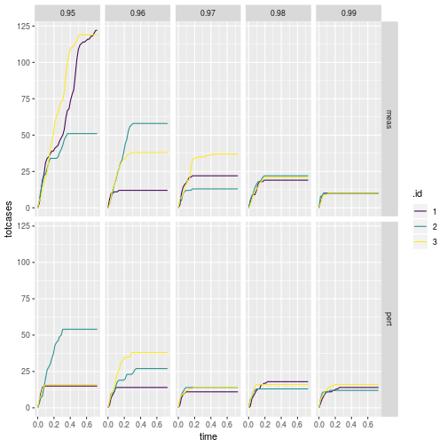

```r
foobar <- foo %>% select(-simdf, -lmod) %>% 
  gather("stat", "maxamp", key = "indicator", value = "value")

foobar %>% ggplot(aes(x = value, color = p)) + scale_x_log10() + 
  geom_freqpoly() + facet_grid(recovery ~ indicator, scales = "free")
```

```
## `stat_bin()` using `bins = 30`. Pick better value with `binwidth`.
```

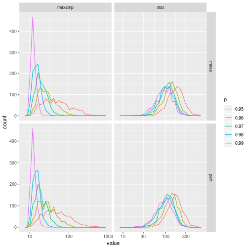

```r
calc_auc <- function(predictions, is_null){
    r <- rank(predictions)
    r1 <- sum(r[!is_null])
    n1 <- sum(!is_null)
    n2 <- sum(is_null)
    (r1 - n1 * (n1 + 1) / 2) / (n1 * n2)
}

np <- length(pvec)
tabs <- list()
n <- 1
for (i in seq_len(np - 1)){
  for (j in seq(i + 1, np)) {
    p1 <- pvec[i]
    p2 <- pvec[j]
    tabs[[n]] <- foobar %>% filter(p %in% c(p1, p2)) %>% 
      group_by(indicator, recovery) %>% 
      mutate(is_null = p == p2) %>% 
      summarise(auc = calc_auc(predictions = value, is_null = is_null)) %>%
      add_column(ptest = p1, pnull = p2)
    n <- n + 1
  }
}

taba <- bind_rows(tabs)

taba %>% ggplot(aes(x = indicator, y = auc, fill = recovery)) + 
  geom_col(position = "dodge") + 
  facet_grid(ptest ~ pnull, labeller =label_bquote(p[1] == .(ptest), p[0] == .(pnull)))
```

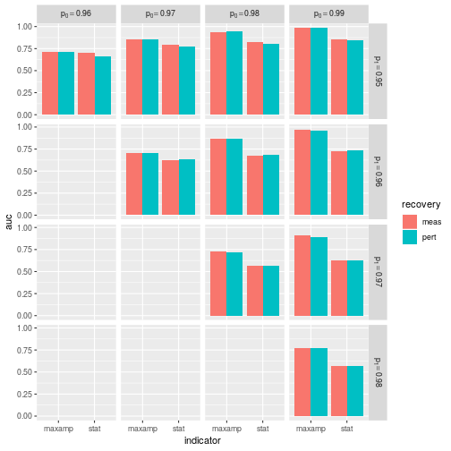

# Elimination


```r
EndemicEquilSIR <- function(beta = (R0 * (mu + gamma)), eta = 17 / 1e6,
                            gamma = 365 / 13, mu = 1 / 50, p = 0,  R0 = 17,
                            verbose = FALSE) {
  ## Computes the endemic equilibrium of an SIR model with immigration, Eq. 6.
  ##
  ## Args:
  ##   beta: numeric. The transmission rate.
  ##   eta: numeric. The rate of infection from outside.
  ##   gamma: numeric. The recovery rate.
  ##   mu: numeric. The birth rate.
  ##   p: numeric. The vaccination uptake.
  ##   R0: numeric. The basic reproduction number.
  ##
  ## Returns:
  ##   A list with numeric elements S, I, and R, coresponding to the
  ##   equilibrium fractions of the population in the
  ##   susceptible, infected, and removed states.
  ## Default parameters relevant for pertussis
  stopifnot(c(beta, eta, gamma, p, R0) >= 0)
  stopifnot(p <= 1)
  a <- - beta * (gamma + mu)
  b <- beta * mu * (1 - p) - (gamma + mu) * (eta + mu)
  c <- mu * (1 - p) * eta
  eq <- (-b - sqrt(b^2 - 4 * a * c)) / (2 * a)
  i.star <- ifelse(p == 1, 0, eq)
  s.star <- ifelse(p == 1, 0, mu * (1 - p)/ (beta * i.star + eta + mu))
  if (verbose) {
    ds.star <- mu *(1 - p) - beta * s.star * i.star - eta * s.star - mu * s.star
    di.star <- beta * s.star * i.star + eta * s.star - (gamma + mu) * i.star
    cat('dS = ', ds.star, '\n')
    cat('dI = ', di.star, '\n')
  }
  return(list(S = s.star, I = i.star, R = 1 - i.star - s.star))
}

gen_sim_step <- function(R0 = 17, N_0 = 1e6, eta = 365 / N_0, tstep = 1 / 52,
                         tdp1 = 10, tstop = 30, tdp2 = tstop - 1e-4, d = 1 / 50, 
                         p1 = 0, p2 = 0, gamma = 365 / 13, p = 0){
  
  params <- c(gamma = gamma,  mu = d, d = d, eta = eta, beta_par = NA,
              rho = 0, N_0 = N_0, p = p) 
  params["beta_par"] <- with(as.list(params), (gamma + d) * R0)
  
  equil <- with(as.list(params), EndemicEquilSIR(beta = beta_par, eta = eta,
                                                 gamma = gamma, mu = d, p = p))
  params["S_0"] <- equil$S
  params["I_0"] <- equil$I
  params["R_0"] <- 1 - equil$S - equil$I
  
  times <- seq(from = 0, to = tstop, by = tstep)
  eps <- 1e-4
  covar <- data.frame(gamma_t = 0, mu_t = 0, d_t = 0, eta_t = 0,
                      beta_par_t = 0, 
                      p_t =  c(0,    0,         p1,   p1,         p2, p2), 
                      time = c(0, tdp1, tdp1 + eps, tdp2, tdp2 + eps, tstop))
  create_simulator(times = times, t0 = 0, transmission = "frequency-dependent",
                   params = params, covar = covar)
}
```


```r
gen_wrap <- function(pstep, g = 326 / 13){
  tdp1 <- 10
  tdp2 <- 20
  tstop <- tdp2 + 4
  tstep <- 1 / 52
  gen_sim_step(tdp1 = tdp1, tdp2 = tdp2, p1 = 0.0, p2 = pstep, 
               tstop = tstop, tstep = tstep, N_0 = 1e7, gamma = g)
}

simus_end <- list()
pstep_vec <- seq(0, 0.6, by = 0.2)
names(pstep_vec) <- pstep_vec

simus_end$meas <- lapply(pstep_vec, gen_wrap)

change_recov <- function(x, newgamma = 365 / 22){
  params <- pomp::coef(x)
  R0 <- with(as.list(params), beta_par / (gamma + d))
  params["gamma"] <- newgamma  
  params["beta_par"] <- with(as.list(params), (gamma + d) * R0)
  x
}

simus_end$pert <- lapply(simus_end$meas, change_recov)

run_sims_end <- function(xx, nreps){
  tmpf2 <- function(x, n){
    pomp::simulate(x, nsim = n, format = "data.frame")
  }
  simdata <- parallel::mcMap(tmpf2, x = xx, n = nreps, mc.cores = 4)
  simall <- bind_rows(simdata, .id = "pstep")
  simall
}

tictoc::tic("elimination simulations")
simdata_end <- parallel::mclapply(simus_end, run_sims_end, nreps = 1000, 
                                  mc.cores = 2) %>% 
  bind_rows(.id = "recovery")
tictoc::toc()
```

```
## elimination simulations: 4171.077 sec elapsed
```

```r
simdata_end %>% filter(time > 16 & time < 24) %>% 
  filter(as.integer(.id) < 3) %>%
  ggplot(aes(x = time, y = cases, color = .id)) + geom_line() + 
  facet_grid(recovery~pstep)
```

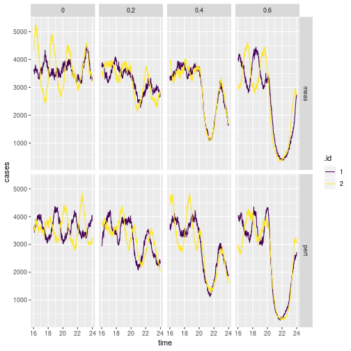


```r
outsm <- simdata_end %>% filter(time > 16 & time < 24 & pstep < 0.8) 

smoothing_model <- function(df){
  span <- 0.4
  stats::loess(Shat_raw ~ time, span = span, data = df)
}

smoothing_model_q_t <- function(df){
  span <- 0.4
  stats::loess(q_t ~ time, span = span, data = df)
}

m_t_calc <- function(df){
  dt <- df$time[2] - df$time[1]
  df %>% mutate(o_t = q_t_smooth - mean(q_t_smooth, na.rm = TRUE),
                m_t = c(NA, diff(o_t / dt)))
}

time_of_pstep <- 20
#These parameters do not need to be known to pick up trends in indicator. They are useful for checking that the smoothing in loess is appropriate though because they allow for our proxy for S to be directly compared to S.
dt <- 1 / 52
Nequil <- 1e7
eta <- 17 / 1e6

tmp <- outsm %>%  
  mutate(gamma = ifelse(recovery == "meas", 365 / 13, 365 / 22)) %>%
  mutate(beta = 17 * (gamma + 0.02)) %>%
  mutate(window = ifelse(time < time_of_pstep, "w1", "w2")) %>% 
  group_by(.id, recovery, pstep) %>% 
  mutate(Ihat = cases / dt / gamma,
         lead_wks = round(365 / gamma / 7 ),
    Shat_raw = lead(cases, lead_wks[1]) * Nequil / (Ihat * dt * beta + eta * dt),
    q_t = lead(cases, lead_wks[1]) / cases) %>%
  group_by(.id, recovery, pstep, window) %>% 
  nest(.key = "simdf") %>% 
  mutate(smooth_mod = purrr::map(simdf, smoothing_model)) %>%
  mutate(simdf = purrr::map2(simdf, smooth_mod, modelr::add_predictions,
                             var = "Shat_smooth")) %>% 
  mutate(smooth_mod_prop = purrr::map(simdf, smoothing_model_q_t)) %>%
  mutate(simdf = purrr::map2(simdf, smooth_mod_prop, modelr::add_predictions,
                             var = "q_t_smooth")) %>% 
  mutate(simdf = purrr::map(simdf, m_t_calc)) %>% 
  select(-smooth_mod) %>%
  unnest(simdf) %>% group_by(.id, window, pstep, recovery) %>%
  nest(.key = "simdf")
```

```
## Warning: `.key` is deprecated

## Warning: `.key` is deprecated
```

```r
## Checking smoothing span

tmp %>% filter(.id == 1) %>% unnest(simdf) %>% 
  ggplot(aes(x = time , y = Shat_smooth)) + geom_line() + 
  geom_line(aes(y = S), col = "red") + 
  geom_point(aes(x = time, y = Shat_raw), alpha = 0.1) + 
  facet_grid(pstep ~ recovery)
```

```
## Warning: Removed 3 rows containing missing values (geom_path).
```

```
## Warning: Removed 20 rows containing missing values (geom_point).
```

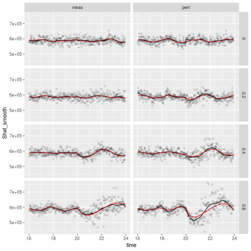

```r
react_end_calc <- function(df, bandfrac = 0.05){
  eps <- diff(range(df$o_t, na.rm = TRUE)) * bandfrac
  test <- abs(df$o_t) < eps
  mean(abs(df$m_t[test]), na.rm = TRUE)
}

max_amp_end_calc <- function(df){
  min_o_t = min(df$o_t, na.rm = TRUE)
  max_o_t = max(df$o_t, na.rm = TRUE)
  max_o_t - min_o_t
}

tmp2 <- tmp %>% 
  mutate(react_end = purrr::map_dbl(simdf, react_end_calc),
         max_amp_end = purrr::map_dbl(simdf, max_amp_end_calc)) %>%
  select(-simdf)

tmp3 <- tmp2 %>% 
  select(.id, window, recovery, pstep, react_end, max_amp_end) %>% 
    gather('react_end', 'max_amp_end', 
         key = "indicator", value = "value") %>%
  group_by(pstep, recovery, .id, indicator) %>% arrange(window) %>% 
  summarise(diff_ind = value[2] - value[1])

tmp3 %>% ggplot(aes(x = diff_ind, fill = recovery)) + geom_histogram() + 
  facet_grid(pstep ~ indicator, scales = "free_x")
```

```
## `stat_bin()` using `bins = 30`. Pick better value with `binwidth`.
```

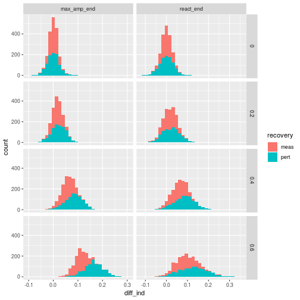

```r
tmp3 %>% ggplot(aes(x = diff_ind > 0, fill = recovery)) + geom_bar() + 
  facet_grid(pstep ~ indicator)
```

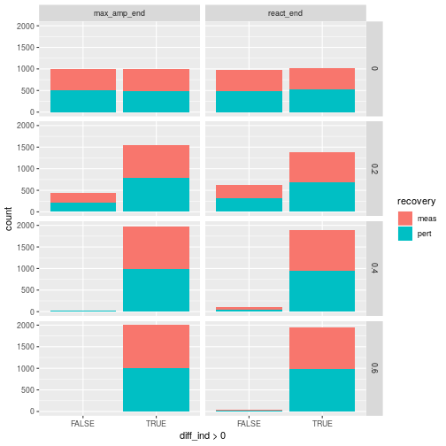

```r
np2 <- length(pstep_vec)
tabs2 <- list()
n <- 1
for (i in seq_len(np2 - 1)){
  pstep_null <- 0
  pstep_test <- pstep_vec[i + 1]
  tabs2[[n]] <- tmp3 %>% filter(pstep %in% c(pstep_null, pstep_test)) %>% 
    group_by(recovery, indicator) %>% 
    mutate(is_null = pstep == pstep_null) %>% 
    summarise(auc = calc_auc(predictions = diff_ind, is_null = is_null)) %>%
    add_column(pstep_test = pstep_test)
  n <- n + 1
}

tab2a <- bind_rows(tabs2)
  
tab2a %>% ggplot(aes(x = as.factor(pstep_test), y = auc, fill = recovery)) + 
  geom_col(position = "dodge") + facet_grid(.~indicator) 
```

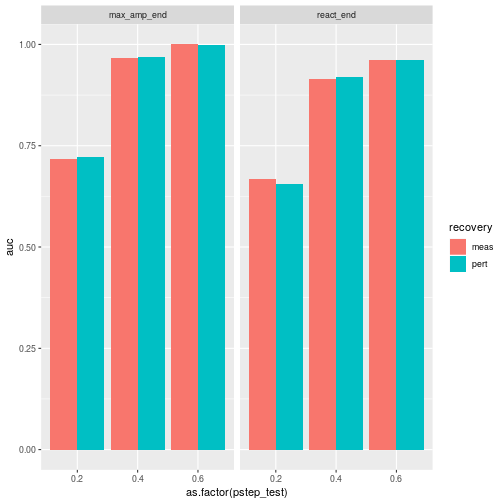

# Figures for the paper


```r
library(ggplot2)
theme_set(new = theme_minimal())
```


## Diagram for emergence


```r
DiseaseFreeJacSIR <- function(gamma = 365 / 13, mu = 1 / 50, p = 0,  R0 = 17,
                          x = R0 * (1 - p), Gamma = gamma + mu){
  rbind(c(-mu , - Gamma * x),
        c(0, -Gamma * (1 - x)))
}

ievf <- function(gamma = 365 / 13, mu = 1 / 50, p = 0, R0 = 17, 
                 x = R0 * (1 - p), Gamma = gamma + mu, norm = 1){
  vec <- matrix(c(x2 = Gamma * x, y2 =  Gamma * (1 - x) - mu), nrow = 1)
  colnames(vec) <- c("x2", "y2")
  n0 <- sqrt(sum(vec^2))
  vec / n0 * norm
}

sevf <- function(norm = 1){
  vec <- matrix(c(1, 0), nrow = 1)
  colnames(vec) <- c("x2", "y2")
  vec * norm
}

calc_dftraj <- function(init = c(0, 10), times = seq(0, 2, by = 1 / 52), ...){
  J <- DiseaseFreeJacSIR(...)
  eigJ <- eigen(J)
  init_transformed <- solve(eigJ$vectors) %*% matrix(init, ncol = 1)
  scale <- function(x) exp(eigJ$values * x) * as.numeric(init_transformed)
  soleig <- sapply(times, scale)
  untransform <- function(x) eigJ$vectors %*% x
  traj <- apply(soleig, 2, untransform)
  data.frame(t = times, S = traj[1, ], I = traj[2, ])
}

pem <- 82 / 85 # 16 / 17 + (2 / 5) * (1 / 17)
evnorm <- 8
traj_times <- seq(0, 20, by = 1 / 52)

iev_targ <- ievf(p = pem, norm = evnorm)
sev_targ <- sevf(norm = evnorm)

iaxd <- data.frame(x1 = 0, x2 = 0, y1 = 0, y2 = 10)
ievd <- cbind(data.frame(x1 = 0, y1 = 0), iev_targ) 
saxd <- data.frame(x1 = -10, x2 = 10, y1 = 0, y2 = 0)
sevd <- cbind(data.frame(x1 = 0, y1 = 0),  sev_targ)

traj <- calc_dftraj(times = traj_times, p = pem)

drawline <- function(df, ...){
  geom_segment(data = df, aes(x = x1, xend = x2, y = y1, yend = y2), 
               arrow = grid::arrow(), lineend = "round", ...)
}

p <- ggplot() + expand_limits(x=15)
p <- p + geom_hline(yintercept = 0, color = "grey")
p <- p + geom_vline(xintercept = 0, color = "grey")
p <- p + drawline(sevd, size = 2, color = "grey")
p <- p + drawline(ievd, size = 2, color = "grey")
p <- p + labs(x = expression(S - bar(S)), y = expression(I - bar(I)))
p <- p + geom_point(data = traj, aes(x = S, y = I))
p <- p + geom_path(data = traj, aes(x = S, y = I), 
                   col = "orange", arrow = grid::arrow(), lineend = "round")
p <- p + geom_text(data = sevd, aes(x = x2, y = y2), 
                   label = "h[1] %*% (list(1, 0))", 
                   hjust = "center", nudge_x = 0, nudge_y = 1, parse = TRUE)
p <- p + coord_fixed(clip = 'off')
pemerg_dia  <- p + geom_text(data = ievd, aes(x = x2, y = y2), 
                  label = "h[2] %*% (list(Gamma * x, Gamma * (1 - x) - mu))",
                  hjust = "center", nudge_x = 0, nudge_y = 1, parse = TRUE)

pemerg_dia
```

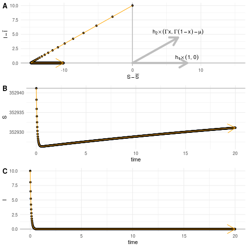

```r
## save as png because mu turns into infinity symbol in pdf output
ggsave("emerge_eigenvector_diagram.png", plot = pemerg_dia, 
       width = 90, height = 50, units = "mm")
```

## Diagram for elimination


```r
EndemicJacSIR <- function(gamma = 365 / 13, mu = 1 / 50, p = 0,  R0 = 17,
                          x = R0 * (1 - p), Gamma = gamma + mu){
  rbind(c(-mu * x, - Gamma),
        c(mu * (x - 1), 0))
}

calc_entraj <- function(init = c(0, 10), times = seq(0, 2, by = 1 / 52), ...){
  J <- EndemicJacSIR(...)
  eigJ <- eigen(J)
  # uncomment to plot level curves
  #eigJ$values <- complex(imag = Im(eigJ$values)) 
  init_transformed <- solve(eigJ$vectors) %*% matrix(init, ncol = 1)
  scale <- function(x) exp(eigJ$values * x) * as.complex(init_transformed)
  soleig <- sapply(times, scale)
  untransform <- function(x) eigJ$vectors %*% x
  traj <- apply(soleig, 2, untransform)
  data.frame(t = times, S = as.numeric(traj[1, ]), I = as.numeric(traj[2, ]))
}

pe <-  0.5 * 16 / 17
traje_times <- seq(0, 2.5, by = 1 / 52)
traje <- calc_entraj(times = traje_times, p = pe)

drawline <- function(df, ...){
  geom_segment(data = df, aes(x = x1, xend = x2, y = y1, yend = y2), 
               arrow = grid::arrow(), lineend = "round", ...)
}

iaxd <- data.frame(x1 = 0, x2 = 0, y1 = -15, y2 = 15)
saxd <- data.frame(x1 = -150, x2 = 150, y1 = 0, y2 = 0)

iampf <- function(norm = 1){
  data.frame(x2 = 0, y2 = norm)
}

sampf <- function(gamma = 365 / 13, mu = 1 / 50, p = 0, R0 = 17, 
                 x = R0 * (1 - p), Gamma = gamma + mu, norm = 1){
  data.frame(y2 = 0, x2 = - sqrt( Gamma / (mu * (x - 1))) * norm)
}

ampnorm <- 10
iamp_targ <- iampf(ampnorm)
samp_targ <- sampf(norm = ampnorm, p = pe)

iamp <- cbind(data.frame(x1 = 0, y1 = 0), iamp_targ) 
samp <- cbind(data.frame(x1 = 0, y1 = 0), samp_targ)

p <- ggplot()
p <- p + drawline(samp, size = 2, color = "grey")
p <- p + drawline(iamp, size = 2, color = "grey")
p <- p + geom_hline(yintercept = 0, color = "grey")
p <- p + geom_vline(xintercept = 0, color = "grey")
p <- p + labs(x = expression(S - bar(S)), y = expression(I - bar(I)))
p <- p + geom_point(data = traje, aes(x = S, y = I))
p <- p + geom_path(data = traje, aes(x = S, y = I), 
                   col = "orange", arrow = grid::arrow(), lineend = "round")


p <- p + geom_label(data = samp, aes(x = x2 / 2, y = y2),
                    label = "h[3] * sqrt(frac(Gamma, mu * (x - 1)))",
                    hjust = "center", parse = TRUE)
p <- p + geom_label(data = iamp, aes(x = x2 , y = y2 / 2),
                    label = "h[3]",
                    hjust = "center", parse = TRUE)
pelim_dia <- p
pelim_dia
```

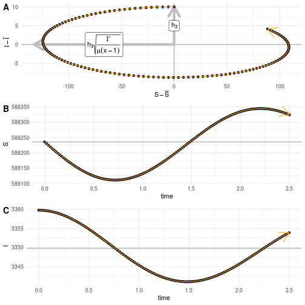

```r
## save as png because mu turns into infinity symbol in pdf output
ggsave("elim_eigenvector_diagram.png", plot = pelim_dia, 
       width = 90, height = 80, units = "mm")
```


## Emergence


```r
theme_set(new = theme_minimal())

pemerg <- taba %>% mutate(indicator_nice = 
                            factor(indicator, 
                                   levels = c("maxamp", "stat"),
                                   labels = c("Max. amplification",
                                              "Reactivity"))) %>%
  ggplot(aes(x = indicator_nice, y = auc, fill = recovery)) + 
  geom_col(position = "dodge") + 
  facet_grid(ptest ~ pnull, 
             labeller = label_bquote(p[1] == .(ptest), p[0] == .(pnull))) + 
  scale_fill_manual(values=c("#999999", "#E69F00"), 
                    name="Pathogen",
                    breaks=c("meas", "pert"),
                    labels=c("Measles", "Pertussis")) +
  labs(x = "Indicator", 
       y = "Area Under ROC Curve (AUC)") +
  theme(axis.text.x = element_text(angle = 90)) + coord_flip()

pemerg
```

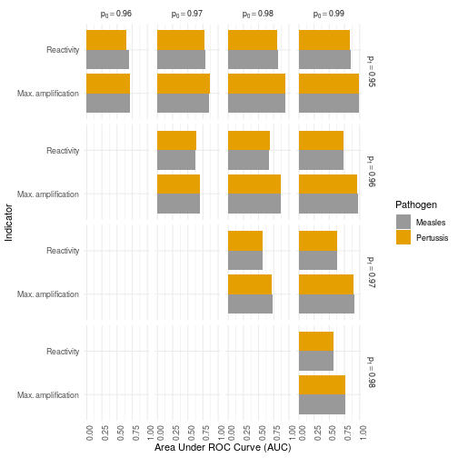

```r
ggsave("emergence_sims_auc.pdf", pemerg, width = 190, units = "mm")
```

```
## Saving 190 x 178 mm image
```


## Elimination


```r
pelim <- tab2a %>% mutate(indlab = recode(indicator, 
                                          react_end = "Reactivity", 
                                          max_amp_end = "Max. amplification")) %>% 
  ggplot(aes(x = as.factor(pstep_test), y = auc, fill = recovery)) + 
  geom_col(position = "dodge") + 
  scale_fill_manual(values=c("#999999", "#E69F00"), 
                       name="Pathogen",
                       breaks=c("meas", "pert"),
                       labels=c("Measles", "Pertussis")) +
  labs(x = "Change in vaccination rate", 
       y = "Area Under ROC Curve (AUC)") + 
  theme(legend.position="top") +
  facet_grid(.~indlab)

pelim
```

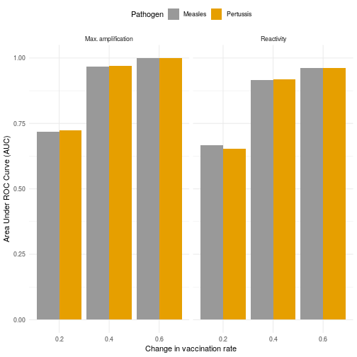

```r
ggsave("elimination_sims_auc.pdf", pelim, width = 90, height = 80, 
       units = "mm")
```
