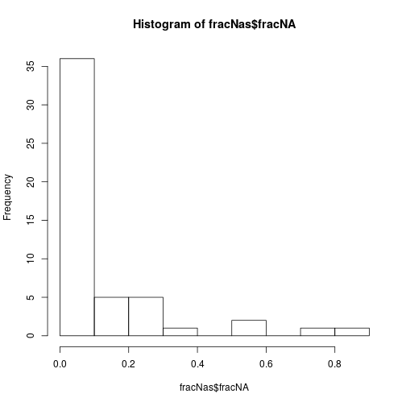
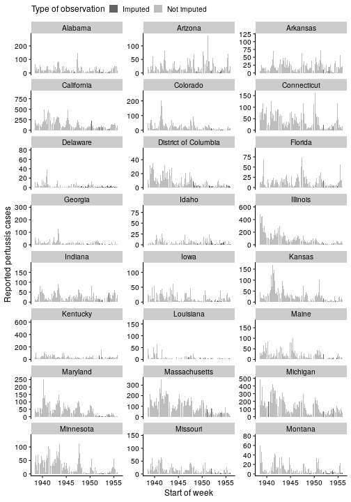
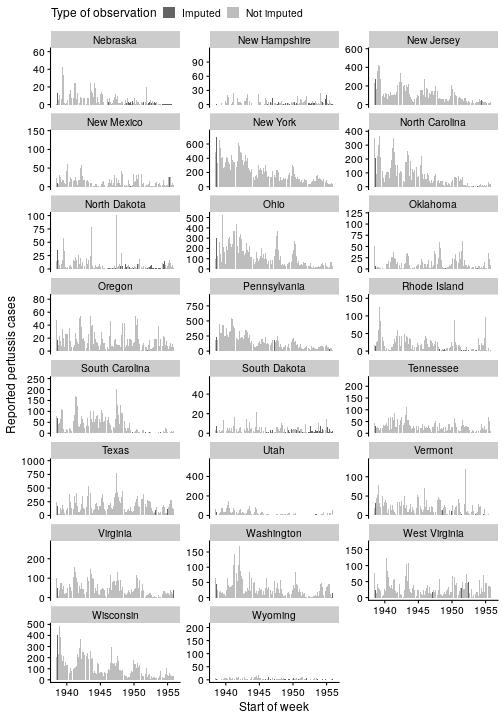
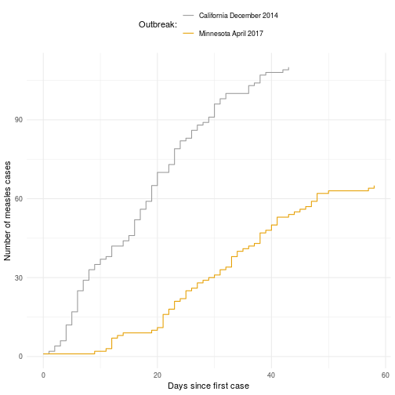

# Summary of goals

Analysis of a linearized SIR model leads to the prediction that that changes in vaccination rates will be reflected in increases in the values of indicators of reactivity and maximum amplification. US national pertussis data in the 1940s and 50s seems appropriate for modeling with a linearized SIR model with an increased vaccination rate. Here, we evaluate whether the predicted changes in the indicators occur.  


```r
library(lubridate)
```

```
## 
## Attaching package: 'lubridate'
```

```
## The following object is masked from 'package:base':
## 
##     date
```

```r
library(tidyverse)
```

```
## ── Attaching packages ─────────────────────────────────────── tidyverse 1.3.0 ──
```

```
## ✔ ggplot2 3.2.1     ✔ purrr   0.3.3
## ✔ tibble  2.1.3     ✔ dplyr   0.8.3
## ✔ tidyr   1.0.0     ✔ stringr 1.4.0
## ✔ readr   1.3.1     ✔ forcats 0.4.0
```

```
## ── Conflicts ────────────────────────────────────────── tidyverse_conflicts() ──
## ✖ lubridate::as.difftime() masks base::as.difftime()
## ✖ lubridate::date()        masks base::date()
## ✖ dplyr::filter()          masks stats::filter()
## ✖ lubridate::intersect()   masks base::intersect()
## ✖ dplyr::lag()             masks stats::lag()
## ✖ lubridate::setdiff()     masks base::setdiff()
## ✖ lubridate::union()       masks base::union()
```

# Data prep

We use Project Tycho pre-compiled pertussis data. An earlier version of this data was analyzed by @magpantay2015. We follow their methods for imputing missing data at the state level and then sum the state-level data to arrive at a national level data set.


```r
pert <- read.csv("US.27836007.csv")
```


```r
strt_cum <- table(pert$PeriodStartDate, pert$PartOfCumulativeCountSeries)
is_b4_76 <- ymd(rownames(strt_cum)) < ymd("1976-01-01")
stopifnot(all(strt_cum[is_b4_76,"1"] == 0))
```


```r
pert %>% filter(is.na(Admin2Name) & is.na(CityName) &
                Admin1Name %in% c(toupper(state.name), "DISTRICT OF COLUMBIA") &
                  PartOfCumulativeCountSeries == 0) %>%
  mutate(start = ymd(PeriodStartDate),
         end = ymd(PeriodEndDate)) -> pbar

stopifnot(all(pbar$end - pbar$start == 6))
```


```r
foobar <- pbar %>% filter(start < ymd("1960-01-01")) %>%
  filter(start > ymd("1938-06-13")) %>%
  group_by(Admin1Name) %>%
  select(Admin1Name, CountValue, start) %>% padr::pad(interval = "week")

foobar %>% group_by(Admin1Name) %>%
  summarise(fracNA = mean(is.na(CountValue))) -> fracNas
fracNas
```

```
## # A tibble: 51 x 2
##    Admin1Name           fracNA
##    <fct>                 <dbl>
##  1 ALABAMA              0.0361
##  2 ALASKA               0.850 
##  3 ARIZONA              0.0361
##  4 ARKANSAS             0.0317
##  5 CALIFORNIA           0.0263
##  6 COLORADO             0.0547
##  7 CONNECTICUT          0.0230
##  8 DELAWARE             0.232 
##  9 DISTRICT OF COLUMBIA 0.101 
## 10 FLORIDA              0.0449
## # … with 41 more rows
```


By and large, we see a similar fraction of missing data as in @magpantay2015 web table 1. Some differences are expected because we are using tycho version 2 data and are calculating missingness across different start and end dates for some time series.


```r
hist(fracNas$fracNA)
```


There is a slight gap in the distribution of missingness at 0.5.


```r
missingness_threshold <- 0.5
excluded_states <- fracNas$Admin1Name[fracNas$fracNA > missingness_threshold]
magpantay_excluded <- toupper(c("Mississippi", "Nevada", "North Dakota", "South Dakota",
                        "Wyoming", "Hawaii", "Alaska"))
setdiff(magpantay_excluded, excluded_states)
```

```
## [1] "NORTH DAKOTA" "SOUTH DAKOTA" "WYOMING"
```

```r
setdiff(excluded_states, magpantay_excluded)
```

```
## character(0)
```

```r
foobar %>% filter(!Admin1Name %in% excluded_states) -> foo2
```
 If we exclude states with greater values of missingness, we obtain a similar set of states as @magpantay2015, based on the dark grey rows in web table 1. We end up including the Dakotas and Wyoming whereas that was discarded in the earlier work.


```r
foo2 %>% group_by(Admin1Name) %>%
  mutate(ctsi = zoo::na.approx(CountValue), na.rm = FALSE) -> foo3

nice_names <- c(state.name, "District of Columbia")
key <- match(tolower(foo3$Admin1Name),
             tolower(nice_names))

foo3$State <- nice_names[key]
```


```r
foo3 %>% ggplot(aes(x = start, y = ctsi, fill = is.na(CountValue))) +
  geom_col() + facet_wrap(~State, scales = "free_y") +
  labs(x = "Start of week", y = "Reported pertussis cases") +
  scale_fill_manual(values=rev(c("#636363", "#bdbdbd")),
                       name="Type of observation",
                       breaks=c(TRUE, FALSE),
                    labels=c("Imputed", "Not imputed")) +
    cowplot::theme_cowplot(font_size = 12) +
   theme(legend.position = "top") -> g


g + ggforce::facet_wrap_paginate(~State, nrow = 8, ncol = 3, page = 1,
                        scales = "free_y") -> g1
g + ggforce::facet_wrap_paginate(~State, nrow = 8, ncol = 3, page = 2,
                        scales = "free_y") -> g2
g1
```



```r
g2
```



```r
ggsave("state-time-series-p1.pdf", plot = g1, width = 7.5, height = 10)
ggsave("state-time-series-p2.pdf", plot = g2, width = 7.5, height = 10)
```
The interpolation seems to fill in values in a reasonable way.

# Transient indicators analysis

First we aggregate to the national level because our model is univariate.


```r
nat <- foo3 %>% group_by(start) %>% summarise(us = sum(ctsi))
```

Pertussis vaccines became more standardized throughout the 1940s and '50s and recieved endorsements from medical authorities. The whole-cell pertussis vaccine became recommended for routine use by the Committee on Infectious Diseases of the American Academy of Pediatrics in 1944. In 1947, the same group recommended a (diptheria-tetanus-pertussis) DTP vaccine for routine use. Minimum potency requirements for pertussis vaccines were established in 1948 and a standard unit of potency in 1953 (p. 63 1981 annual summary). Although little data on vaccination rates appears to be available, it is believed that vaccination for pertussis became common in the 1940s and 1950s @IOM. 

On this basis, we predict based on the simple SIR model \eqref{TODO} that reactivity and maximum amplification should increase throughout this period. To test this prediction, we divide the data from 1940 to 1955 into three 5-year windows and calculate these indicators in each window. We use five-year windows so as to include a full cycle of pertussis reports in each window. Using a full cycle ensures that we can estimate the maximum amplification using \eqref{TODO}. We do not analyze data outside of this window because weekly reports are not available and our reactivity indicator requires weekly data.

The loess model is fitted to the whole time series and then the first and last part of the predictions are discarded because we suspect that they have higher variance due to the smaller amount of data available for the loess model at the ends of the series.


```r
smoothing_model_q_t <- function(df){
  span <- 0.4
  stats::loess(q_t ~ time, span = span, data = df)
}

lead_wks <- 2

brks <- lubridate::ymd(c("1900-01-01", "1940-01-01", "1945-01-01", "1950-01-01", 
                         "1955-01-01", "1999-01-01"))
nat2 <-
  nat %>%
  mutate(window = cut(start, breaks = brks)) %>%
  filter(!is.na(window)) %>%
  mutate(time = lubridate::decimal_date(start),
         q_t = lead(us, lead_wks) / us)

smooth_mod <- smoothing_model_q_t(nat2)
nat3 <- modelr::add_predictions(nat2, smooth_mod, var = "q_t_smooth")
  
m_t_calc <- function(df){
  dt <- df$time[2] - df$time[1]
  df %>% mutate(o_t = q_t_smooth - mean(q_t_smooth, na.rm = TRUE),
                m_t = c(NA, diff(o_t / dt)))
} 

react_end_calc <- function(df, bandfrac = 0.05){
  eps <- diff(range(df$o_t, na.rm = TRUE)) * bandfrac
  test <- abs(df$o_t) < eps
  mean(abs(df$m_t[test]), na.rm = TRUE)
}

max_amp_end_calc <- function(df){
  min_o_t = min(df$o_t, na.rm = TRUE)
  max_o_t = max(df$o_t, na.rm = TRUE)
  max_o_t - min_o_t
}

nat4 <-
  nat3 %>%  group_by(window) %>%
  nest(windata = c(start, time, us, q_t, q_t_smooth)) %>%
  mutate(windata2 = map(windata, m_t_calc)) %>%
  mutate(react_end = purrr::map_dbl(windata2, react_end_calc),
         max_amp_end = purrr::map_dbl(windata2, max_amp_end_calc)) 

nat4
```

```
## # A tibble: 5 x 5
## # Groups:   window [5]
##   window            windata windata2           react_end max_amp_end
##   <fct>      <list<df[,5]>> <list>                 <dbl>       <dbl>
## 1 1900-01-01       [81 × 5] <tibble [81 × 7]>    0.0104       0.0151
## 2 1940-01-01      [261 × 5] <tibble [261 × 7]>   0.00982      0.0141
## 3 1945-01-01      [260 × 5] <tibble [260 × 7]>   0.0132       0.0182
## 4 1950-01-01      [261 × 5] <tibble [261 × 7]>   0.0171       0.0233
## 5 1955-01-01       [51 × 5] <tibble [51 × 7]>    0.0271       0.0245
```

The predicted increase in the indicators does occur for all of the non-boundary windows. 

# Figures for publication


```r
library(ggplot2)
theme_set(new = theme_minimal())

pcases <- nat3 %>% ggplot(aes(x = time, y = us)) + geom_col() + 
  labs(x = "Date", y = "US pertussis cases")

pqsmooth <- nat3 %>% ggplot(aes(x = time, y = q_t_smooth)) + geom_line() + 
  scale_x_continuous(breaks = decimal_date(brks)) + 
  labs(x = "Date", y = expression(paste("Smoothed ", q[t])))


ind_plot_df <-
  nat4 %>% select(window, react_end, max_amp_end) %>%
  filter(!window %in% c("1900-01-01", "1955-01-01")) %>%
  pivot_longer(-window) %>%
  mutate(
    win_pretty = recode(
      window,
      "1940-01-01" = "1940-1945",
      "1945-01-01" = "1945-1950",
      "1950-01-01" = "1950-1955"
    ),
    indicator = recode(name,
                       "react_end" = "Reactivity",
                       "max_amp_end" = "Max. amplification")
  )

pinds <- ind_plot_df %>% ggplot(aes(x = win_pretty, y = value, color = indicator)) + 
  geom_point() + labs(x = "Time window", y = "Value") +
    scale_color_manual(values=c("#999999", "#E69F00"), 
                    breaks=c("Max. amplification", "Reactivity"),
                    name = "Indicator:") +
  theme(legend.position="top")

ppert <- cowplot::plot_grid(pcases, pqsmooth, pinds, 
                             labels = "AUTO", nrow = 3)
```

```
## Warning: Removed 2 rows containing missing values (geom_path).
```

```r
ppert
```



```r
ggsave("endemic_pertussis_analysis.pdf", ppert, width = 90, units = "mm")
```

```
## Saving 90 x 178 mm image
```


# References
